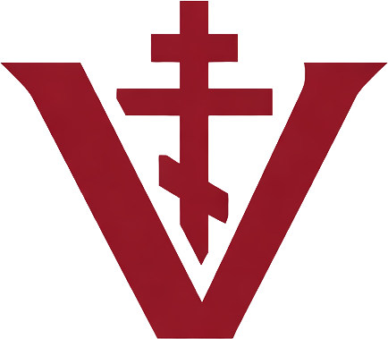

# vondrashek.com

Personal website for **John VonDrashek** — Ruthenian Catholic software developer building tools at the intersection of faith and technology.

**[View Live Site →](https://vondrashek.com)**


---

## About

A portfolio and personal site featuring:

- **Byzantine-inspired design** — Burgundy & gold liturgical color palette with Eastern iconography
- **Project showcase** — Faith-integrated software, game development tools, and developer utilities
- **Responsive layout** — Mobile-friendly with accessible navigation

### Design Elements

<p align="center">
  
</p>

The site incorporates:
- **EB Garamond** serif typography for headings
- **Byzantine icons** from the Metropolitan Museum of Art (public domain)
- **Christ Pantocrator** from Saint Catherine's Monastery, Sinai (6th century)

---

## Tech Stack

| Technology | Purpose |
|------------|---------|
| [Astro](https://astro.build) | Static site generator |
| TypeScript | Type-safe components |
| GitHub Pages | Hosting |
| GitHub Actions | CI/CD deployment |

---

## Project Structure

```
/
├── public/
│   ├── images/          # Icons and imagery
│   ├── favicon.svg
│   └── CNAME
├── src/
│   ├── components/      # Reusable components (Icons)
│   ├── layouts/         # Base layout with header/footer
│   ├── pages/           # Route pages
│   │   ├── index.astro
│   │   ├── projects.astro
│   │   ├── about.astro
│   │   └── contact.astro
│   └── styles/          # Global CSS
└── .github/workflows/   # Deployment automation
```

---

## Development

```bash
# Install dependencies
npm install

# Start dev server
npm run dev

# Build for production
npm run build

# Preview production build
npm run preview
```

---

## Deployment

The site auto-deploys to GitHub Pages on every push to `main` via GitHub Actions.

### Custom Domain Setup

1. Add `A` record pointing to GitHub Pages IPs
2. Add `CNAME` record for `www` subdomain
3. The `public/CNAME` file handles the domain configuration

---

## Image Credits

Byzantine icons used under public domain from:
- **Metropolitan Museum of Art** — [Open Access Initiative](https://www.metmuseum.org/about-the-met/policies-and-documents/open-access)
- **Custom header icon** — Byzantine-style religious imagery

---

## License

MIT License — feel free to use this as a template for your own site.

---

<p align="center">
  <em>Slava Bohu</em> — Glory to God
</p>
